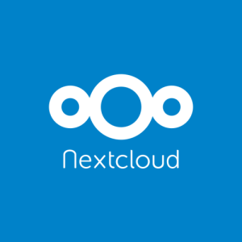

## Nextcloud



**Nextcloud is a cloud software like Google Drive, allowing to host files, but also containing multiple very useful applications. However, unlike Google Drive, it is open-source and free**.

### Features of Nextcloud

Nextcloud allows you to:

- Have an online file storage space that is totally yours.
- Have access to lots of different applications all open-source that allow you to manage to-do lists, *kanban boards*, calendars, contacts, notes, recipes, maps, track your phone's location, collaborate on documents, and much more.

> `r emo::ji("light_bulb")` *It is totally possible to synchronize your Joplin database on a Nextcloud installation. This is recommended by the creators of Joplin, because Joplin has a Nextcloud integration application with Nextcloud !*

### Installation of Nextcloud

Here, it's a bit special. **Nextcloud cannot be installed on your computer**. It must be installed on a **[computer server](https://en.wikipedia.org/wiki/Server_(computing))**, which is a particular computer made to answer requests from "clients" (like your computer) via the internet. This server can be owned by a company (many companies rent servers to host their website, storage space like Nextcloud or other things); or, you can buy a small one for yourself, like a [Raspberry Pi](https://en.wikipedia.org/wiki/Raspberry_Pi). It is still possible to make your computer a server; but this is not practical. The "server" application would have to be running on your computer at all times for your Nextcloud "instance" to be accessible.

So, we won't see the installation of Nextcloud here, which can be complicated. You will however have a list of options to get a Nextcloud server for free, or at a low cost. Keep in mind though that **these different options represent different levels of security for your data**. If you want to make sure that the data on your Nextcloud server is only accessible to you, you will need to purchase your own server (see below). By choosing a third party hosting company, it is possible that your data can be analyzed for advertising purposes (although this is much less likely than with Google Drive). By doing so, you also accept the fact that this company has your data on their servers, and that **these hosting companies will be able to read your data, or submit it to the law and provide it to the authorities if required by them**. At this level, some countries (such as Switzerland) have a stricter jurisdiction in terms of privacy protection. However, if you wish to rely on a hosting company but keep your data totally private, **you will need to encrypt the existing data on your Nextcloud**. This is possible, but we won't talk about it today.

So here are different options to get a Nextcloud instance:

**By a third party host with Nextcloud pre-installed:**

- [Hertznet](https://www.hetzner.com/storage/storage-share) : German host, very competitive prices, very good performance. My personal choice.
- [Wolkli](https://woelkli.com/fr) : Swiss host. Much more expensive, but difficult to do better in terms of data protection (Swiss laws normally protect any access against your will).
- [Cloudamo](https://cloudamo.com/) : European hosting company. Offers a free version that we will use today, but also paid options. Sometimes a bit slow.

**Buying your own server:**

- Buy a [Raspberry Pi](https://www.buyapi.ca/) and [install Nextcloud on it](https://ownyourbits.com/nextcloudpi/).
- Buy a prepared server from [those recommended by Nextcloud](https://nextcloud.com/devices/).

**For this workshop, we will use an account on a hosting company that offers a "free" Nextcloud account with access to many applications, "Cloudamo".**

- Go to the [Nextcloud main page](https://nextcloud.com/signup/).
- In the bar in the center, enter your email address.
- In the list of hosts below, choose `Cloudamo`.
- Click on `Sign up`.
- In the page that opens, choose a password and click on Log in.
- Go to your mailbox to find the confirmation email from `Cloudamo`. **Look in your spam folder**.
- Click on the validation link in the e-mail from Cloudamo and log in on the page that opens.

> `r emo::ji("light_bulb")` *If you decide to use Nextcloud and you liked Cloudamo, you can choose a subscription with this host to get more storage space! But I highly recommend [Hertznet](https://www.hetzner.com/storage/storage-share).*

### Getting started with Nextcloud

In Nextcloud, you can switch from one application to another thanks to the icons at the **top of the screen**. **At the top right** is an icon that allows you to change different settings related to your profile, or to log out.

### Exercises

#### 1. Creating tasks with different priorities, in different categories

- On Nextcloud, go to the `Tasks` tab.
- In the menu on the left, click on `Add a list` to create a to-do list named `Personal`. Do the same thing to create another list named "Social".

> `r emo::ji("light_bulb")` *To-do lists, just like the calendars we will see next, are associated with colors. Use them to easily differentiate between different lists, and thus categorize your tasks!*

- In the "Nextcloud" task list, create 5 new tasks:
  - Create tasks for exercise 1
  - Understand how Nextcloud works
  - Watch a cute cat video
  - Watch a cute dog video
  - Do the dishes

- For the "Understanding how Nextcloud works" task, use the small button to the right of the task to add three subtasks:
  - Understand how Nextcloud tasks work
  - Understand how Nextcloud *kanban* boards work
  - Understand how Nextcloud calendars work

- In the "Social" task list, create 2 new tasks:
  - Call my best friend to tell her I like her a lot
  - Prepare a party

- Click on each of these tasks in turn. In the menu that opens on the right, set a priority for these tasks.
- At the top right of the screen, find the button to choose how the tasks are sorted. Sort them by priority, and see how they are organized.

#### 2. Putting comments in the tasks

- On Nextcloud, go to the `Tasks` tab.
- Click on each of the tasks created during exercise 1 in turn.
  - In the menu that opens on the right, write some details about the task. For example: the dog video you want to watch must be about a Samoyed. You can even put a link to a video you want to watch later.

#### 3. Create and use a Kanban board

- On Nextcloud, go to the `Deck` tab.
- In the menu on the left, use `Add a board` to create a new *kanban* board named "Organization and open-source workshop".
- Go to this new board, and create 3 columns in it: "To Do", "In Progress", and "Completed".
- In the "To Do" column, use the little `+` button to create 4 new "cards":
  - Discover Joplin
  - Discover Zotero
  - Discover Nextcloud
  - Discover methods to implement them
- Move the cards to the right columns: the first three should go in the "Done" column. The 4th one must go in the "to do" column. The last one must stay where it is.
- Click on the "Discover Nextcloud" card. In the description of the card, write the following text:
```
- [ ] Understand what is Nextcloud
- [ ] Understand what Nextcloud is for
- [ ] Do the exercise 1
- [ ] Do exercise 2
- [ ] Do exercise 3
- [ ] Do exercise 4
- [ ] Do exercise 5
- [ ] Do exercise 6
```
- Close the card window, and look at what is now written on it in the board.
- Reopen the card window by clicking on it. Check the boxes in the descriptions with the click of your mouse. Go back to the board, and look at what is happening.
- At the top right, find the button that opens the board menu. Go to the "Tags" tab.
- Create two new tags, choosing the colors you want: "Software" and "Methods".
- Open the description of the cards to put the corresponding tag on them. Look at the visual result of your chart.

> `r emo::ji("light_bulb")` *Kanban boards are excellent for visually seeing the status of a project, whether for yourself or with others. It may seem intimidating, but don't hesitate to try it! Many videos and articles exist on the internet to learn about them, if you are curious.*

#### 4. Using the calendar

- On Nextcloud, go to the `Agenda` tab.
- Next to the `Today` button in the left menu, use the button that allows you to change the view (day, week, month, etc.). Try the different views, then select the month view.

> `r emo::ji("light_bulb")` *The groups of tasks and events of the calendar are within the same file in Nextcloud! This is because both are in the format named "[ICalendar](https://fr.wikipedia.org/wiki/ICalendar)". The ICalendar format is a data format used by almost all existing mailboxes. It is the same one that is used, generally, when you receive an invitation to an event by mail! It is also a format that makes synchronization with your phone very easy, as we will see soon. If one of your tasks is associated with a date, it will appear in your calendar!*

- Double-click in the box corresponding to today to bring up the window allowing you to create a new event.
- Name this event "End of Nextcloud exercises". Schedule it for today, and to start in 10 minutes. Its duration does not matter. Put it in the "Personal" calendar.
- Create a new event on today's date, named "Workshop to discover open-source software to get organized". Check the box to indicate that this will be an all-day event. Put it in the "Personal" calendar again.
- Create a new event in two days, named "Meet with myself", from 3:00 PM to 5:00 PM, and put it in the "Social" agenda.

> `r emo::ji("light_bulb")` *As you can see, the spots that are displayed in your calendar are associated with the color of the calendar in which they are located! This is very useful to be able to visually differentiate very quickly which event concerns which area of your life. As for the list of tasks, take advantage of it !*

#### 5. Synchronizing Nextcloud tasks with your phone

- Take your cell phone in hand.

- If you are on an android phone:
  - Go to the *Google Play Store* to download the free, open source "[Tasks.org](https://play.google.com/store/apps/details?id=org.tasks&hl=en_US&gl=US)" app (or use F-droid for that).
  - Open the app, and tap the menu icon in the top left corner. Go to the `Settings` section.
  - Tap the `Add Account` option, then choose a `CalDAV` account.
  - In the `User name` field, enter the email address you used to sign up for Cloudamo.
  - In the `Password` field, enter the password you use to log into Cloudamo.
  - In the `URL` field, enter `https://us.cloudamo.com`.
  - Validate, then let the application do its synchronization.
  - In the application menu, check that you now have access to the task lists you created on Cloudamo. Click on the tasks to see that you can edit them in all their details: their priority, their notes, their subtasks, etc.

> `r emo::ji("light_bulb")` *Tasks.org is a totally open-source and free application to manage your tasks. It has a lot of features. Change its theme, set icons for your to-do lists, use its widgets to quickly add to-dos from your home screen, make recurring to-dos, and much more!*

- If you are on an Apple phone:
  - Open the `Reminders` application.
  - Select the `Calendar` option.
  - Select the `Accounts` option, then `Add Account`.
  - Select the `Other` option as the account type, then `Add CalDAV account`.
  - In the `URL` field, enter `https://us.cloudamo.com`.
  - In the `User Name` field, enter the email address you used to sign up for Cloudamo.
  - In the `Password` field, enter the password you use to log into Cloudamo.
  - Let the application do its synchronization.
  - Go to the Reminders application and check that you now have access to the task lists you created on Cloudamo.

> `r emo::ji("warning")` ***It seems that IOS will not allow communication with your Nextcloud account if it is not on a server that offers so-called "encrypted" communication using a valid SSL certificate. If you have problems, you can download another application from the appstore that can handle it, like [2Do](https://apps.apple.com/us/app/2do-todo-list-tasks-notes/id303656546).***

> `r emo::ji("warning")` ***Apple phones do not have many open-source and private applications available. It is impossible for me to say who will be able to access your data using these applications. On the other hand, Tasks.org on Android does not have this problem. At your own risk!***

> `r emo::ji("light_bulb")` *Know that there is a free open-source application to synchronize and view your Nextcloud Deck Kanban boards on your phone! Go to your app store, and search for "Nextcloud Deck".*

#### 6. Synchronizing the Nextcloud calendar with your phone

- Take your cell phone in hand.

- If you are on an android phone:
  - Go to the *Google Play Store* to download the free, open source "[DAVx5](https://play.google.com/store/apps/details?id=at.bitfire.davdroid&hl=en_US&gl=US)" app (or use F-droid for that).
  - Open the application, and get to the screen that allows you to add an account. Choose the option `Connect with a URL and a username`.
  - In the `URL` field, enter `https://us.cloudamo.com`.
  - In the `User Name` field, enter the email address you used to sign up for Cloudamo.
  - In the `Password` field, enter the password you use to log into Cloudamo.
  - Let the application do its synchronization.
  - Go to your phone's calendar. If you don't have one yet, you can download the open-source application [Simple calendar](https://play.google.com/store/apps/details?id=com.simplemobiletools.calendar&hl=en_US&gl=US).

> `r emo::ji("light_bulb")` *Despite its strange name, DAVx5 is a fantastic application. It is secure and recommended by Nextcloud developers to sync your phone with your Nextcloud installation. If you choose another Nextcloud host, you can simply enter the URL of the Nextcloud server you are connecting to instead of Cloudamo's.*

> `r emo::ji("warning")` ***On Android, if you are using the "Google" calendar, it is impossible for me to know if your calendar data will be read or shared by Google. I recommend you to use an open-source application like Simple calendar instead.***

- If you are on an Apple phone:
  - Open the `Reminders` application.
  - Select the `Calendar` option.
  - Select the `Accounts` option, then `Add Account`.
  - Select the `Other` option as the account type, then `Add CalDAV account`.
  - In the `URL` field, enter `https://us.cloudamo.com`.
  - In the `User Name` field, enter the email address you used to sign up for Cloudamo.
  - In the `Password` field, enter the password you use to log into Cloudamo.
  - Let the application do its synchronization.
  - Go to your phone's calendar.

> `r emo::ji("warning")` ***Apple phones do not have many open-source and private applications available. It is impossible for me to say who will be able to access your data using these applications.***

- Whatever your phone is:
  - Check in your calendar settings that the "Personal" and "Social" calendars are synchronized.
  - Check that the events you have created previously are displayed.

#### 7. Synchronizing your files with your computer or phone

- On your computer:
  - Go to [this page](https://nextcloud.com/install/#install-clients) to download the Nextcloud software that will allow the synchronization of your files between your computer and Nextcloud

> `r emo::ji("light_bulb")` *Indeed, Nextcloud is also used to store files, just like Google Drive, One Drive, or Drop Box!*

  - Once you have downloaded the executable, install it.
  - Run the program.
  - Tell the program the URL of your Nextcloud server (`https://us.cloudamo.com`), your Cloudamo username, and your password.
  - Let the synchronization take place.

> `r emo::ji("light_bulb")` *From now on, if you drop a new file in your "Nextcloud" folder on your computer, it will be uploaded to Cloudamo's servers. Conversely, if a file has been added to your Nextcloud on Cloudamo's servers, it will be downloaded to your computer. Thus, there is a constant synchronization, via this small software, between your Nextcloud installation and your computer in terms of files. You can, of course, customize this synchronization in the application settings.

- On your phone:
  - Install the Nextcloud app from your app store
  - Launch the Nextcloud app, and tell it the Cloudamo URL, along with your username and password.

> `r emo::ji("light_bulb")` *You will now be able to access files on your Nextcloud from your phone ! The memory of a phone being precious, by default, the Nextcloud application will download files from your Nextcloud installation only when you want to access them.*
