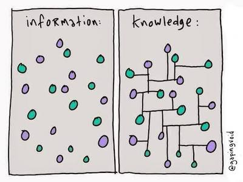
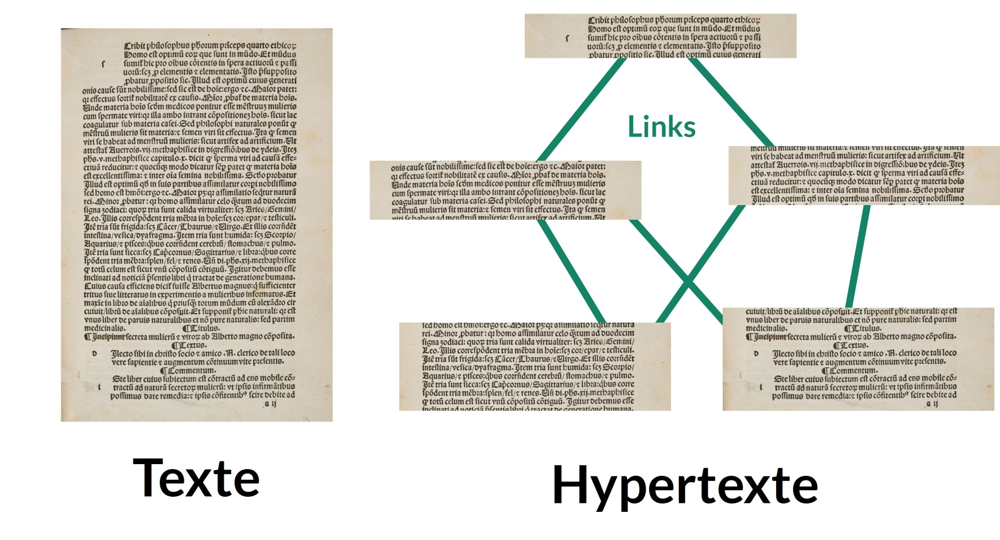

## The Zettelkasten method

**The *Zettelkasten* is a method of knowledge management and note taking.**

The word *Zettelkasten* comes from German, and could be translated as "note box" or "idea box", or "sliding box".

It is a method used in scientific research or studies; however, it can also be useful for organizing your general knowledge.

This method was developed by Conrad Gessner in the 16th century, and has been used by various researchers since. In particular, Nijlas Luhmann (German sociologist) had a *Zettelkasten* of 90,000 cards, to which he attributed much of his great writing productivity (more than 70 books and 400 scientific articles during his lifetime).

### Purpose of the *Zettelkasten*

The *Zettelkasten* is used to take note of knowledge with the help of a software, or papers.

This method has several very important features:

1. **It makes it easier to classify knowledge in order to find it very quickly.**

The *Zettelkasten* achieves this by associating each note with labels, but also with other notes. Thus, many different paths can lead to your note; and since each note represents a specific piece of knowledge, you can find it easily!

2. **It classifies information in a very simple and instinctive way.**

If you are interested in religion and philosophy, and you want to make a note about the famous "[Pascal's wager](https://fr.wikipedia.org/wiki/Pari_de_Pascal)"; would you put this note in the "religion" category, or in the "philosophy" category? In a *Zettelkasten*, this question does not arise, because there are no categories. This makes sorting or finding your note much more instinctive.

3. **It allows us to easily see the connections that can exist between different knowledge.**

This allows for a strong creativity, by perceiving links between information that we would otherwise have seen as separate.

4. **It is used to encapsulate information.**

To understand encapsulation, imagine the following situation: you decide to create a web site about elephants. On your site, you have a page that talks about what elephants do all day, and another that talks about the effect of elephant dung on their environment. You'll soon realize that these two pages are going to have to talk, at some point, about what the elephants eat.

So you have a choice: you can write about what the elephants eat on these two pages, which requires you to rewrite the information twice. Also, if that information changes (for example, a new discovery is made about the diet of elephants) you will have to change both pages. However, you can also make a page that talks about what elephants eat, and simply put a link to that page in your other two pages.

In this way, you don't have to rewrite the information over and over again, and you only have to change it once if you need to. You have thus encapsulated the information about what elephants eat by separating it from the rest, and linking to it where necessary.

The *Zettelkasten* method encourages encapsulation as much as it is possible, making you write things once, and making it easy to edit and connect your knowledge.

5. **It avoids having to search for information in long notes or texts.**

This is a consequence of encapsulating information. To use the previous example, you don't have to skim one of the two long pages on the daily life of elephants, or the one on the effects of their dung to find out what they eat. You'll just have to find the right page, or the right note, to find the right information.

6. **It makes taking notes more enjoyable.**

This is certainly the most subjective aspect, but it seems undeniable to me. Taking notes on complicated subjects is often a time-consuming activity, and it can be very discouraging to end up with a bunch of long and complex notes that don't serve our purposes well, and seem useless in the end. The *Zettelkasten* makes the activity of taking notes on anything and everything - how to identify a kind of tree, statistics related to a problem in the world that affects us, thoughts that cross our mind - organized, rigorous, and above all productive. Each of the notes created within a *Zettelkasten* invites reflection and creation. Each of the notes can be quickly retrieved for use when needed. Thus, this activity becomes less laborious, less full of doubts, and much more satisfying. Each note becomes a seed planted in the ground that will bear fruit in the future.

*Image from [Gapingvoid](https://www.gapingvoid.com/blog/2014/01/22/information-vs-knowledge/).*

### Setting up a *Zettelkasten*

Nowadays, it is very easy to set up a *Zettelkasten* using a software like Joplin. However, this method requires a little bit of practice.

Indeed, a *Zettelkasten* must respect three main principles, which we will state here.

#### The principles of the *Zettelkasten*

1. **The *Zettelkasten* must be composed of notes that respect the "principle of atomicity".**

Behind this complicated name lies a simple reality: **your notes should be as short as possible, and should consider a very specific topic in particular**. This is atomicity: just as an atom is defined as an object that is not separable into parts, your notes should, as much as possible, not be separable into other notes. **This allows you to encapsulate the information as much as possible**, and avoid very long notes that can be a nightmare to find. Smaller notes will also make it easier to make links between notes (see below).

In practice, it is quite normal to start writing short notes; then, as they get longer if you add things to them, to split them into several notes. In the *Zettelkasten*, the notes are called *Zettel*, which means in German..."note"! Thus, each *Zettel* must respect the principle of atomicity.

2. **The "Zettelkasten" should not be textual, but "hyper-textual".**

Again, behind these complicated words lies a simple reality.

Imagine for a moment if the online encyclopedia Wikipedia was not composed of a huge number of different articles (as it is now), but of a single web page containing all the information of Wikipedia? If this were the case, the Wikipedia encyclopedia would be in a classic "textual" form: a long linear text with a beginning and an end, like a book. To find the right information, we would have to look at what is between this beginning and this end, and our reading would always be guided in that direction. This is what we do when we read a dictionary.

Fortunately, Wikipedia is not a textual encyclopedia, but a hyper-textual one. This means that it is composed of documents (articles) linked together by hyperlinks. You know these hyperlinks well: they are simply the links you find on web pages, and on which you are used to click.

Hyper-textual organization avoids structuring information in a linear way (from a beginning to an end), and makes its writing - and access - quite "organic". In Wikipedia, articles are created and linked to each other as they are needed. The order in which these articles are written does not matter; nor does the order in which they are read. What matters is the presence of connections and links between them.

The same applies to a *Zettelkasten*, which is often compared to a "personal Wikipedia". In a *Zettelkasten*, the priority is not so much the collection of information, but the connection of information to each other. For this, the *Zettels* (notes) contained in a *Zettelkasten* will all have a unique identifier, like a web page. This identifier will allow to create connections between the *Zettels*, just like links between wikipedia pages.

3. **There is one *Zettelkasten* for one person, and one person per *Zettelkasten*.**

A *Zettelkasten* must be personal, and several people should not work together on one *Zettelkasten*. The reason for this is that we are all very different in the way we choose, record, and connect the information we come in contact with. So what will make sense to one person may not make sense to another. A *Zettelkasten* must be extremely comfortable for you. And although you won't always remember everything you wrote down, and how you made the connections, they will make sense to you when you find them, at the time when you need them. It is also important for your memory and your learning that you are the one who takes the time to make the notes, in order to get into the habit of doing so, and in order to better retain the information in them.

On top of all that, a *Zettelkasten* can contain very personal things. I'm not necessarily talking about passwords, or your bank details: although these can go into a *Zettelkasten*, this is not recommended. However, your *Zettelkasten* may contain notes about your emotions; your thoughts; or your experiences. It is important then that you feel comfortable with the idea of putting these words into notes, knowing that they will not be read by anyone but you if you do not wish to.

Your *Zettelkasten* will be yours; a real home for your thoughts and ideas.

#### Anatomy of the *Zettelkasten*

Now that we have seen the main principles of the *Zettelkasten*, it is time to see how to set it up, practically.

Let's start with the components of a *Zettelkasten*: the *Zettels*, the labels, the links, and the boxes.

##### The *Zettels*

A *Zettel* is a note, and it is the basic component of the *Zettelkasten*.

*Image from [zettelkasten.de](https://zettelkasten.de/).*

A *Zettel* is composed of three parts:

1. A unique identifier
2. A body/content
3. A footer that contains references

And that's it!

When making a *Zettelkasten* in paper format, it is important to have a well-defined methodology for choosing the unique identifier of each *Zettel*. But when you make a *Zettelkasten* with a program like Joplin (what I will propose here), you don't need to worry about it!

Indeed, when Joplin creates a new note, it is automatically associated with a unique random identifier which will not change (even if you change the title of the note afterwards). You can see this by clicking on the icon that allows you to see the note's properties in Joplin, at the top right of the interface.

The body or content of the note should be clear and concise. If it becomes too long, then it would be very interesting to see if the note can be split into several notes, which will all remain as short as possible. It is important, as much as possible, that you yourself write the body of the note. This pushes you to write your own version of the information, which leads to a better understanding of it, but also to better recall it. So, as much as possible, **avoid simply cutting and pasting information into a note**.

The footer of the note, containing the references, can be generated automatically by the software if it manages bibliographic references (this is the case of Joplin with the BibTex plugin). If the note contains some of your thoughts, you can leave this part empty.

##### The tags

Let's remember what was said earlier: **a *Zettelkasten* has no categories.**

This means that *Zettelkasten* will not be categorized in any way. Instead, **the *Zettelkasten* uses tags**.

The difference between tags and categories is important to understand. A category could be thought of as a box; a tag, as a small colored sticker that could be stuck on a note. Thus, a note can have only one category (it can only be put in one box), but it can have several tags (several stickers).

Thus, in the *Zettelkasten*, notes will never be categorized. When a note is created, you only have to think about the tags you want to associate it with. For example, a note about what elephants eat might have the tags "elephants", "food", and "biology". The process is much more organic, and much simpler: there is no real hesitation about where to put your note. You just have to put the tags that you think correspond to it. That's good, because Joplin handles tags very well!

Tags are important so that you can easily make connections between your notes in a very creative way. For example, if you look at all your notes with the tag 'food', you might find interesting relationships between what notes that you've made about the diet of different species.

##### The links

The links between *Zettels* are very important in a *Zettelkasten*. They allow you to find information easily, to structure it, but also to see things you would not have seen otherwise.

A link in a *Zettle* works exactly like a link in wikipedia, which will bring you to another article. To make this link, you just need to use the unique ID of the *Zettle* you want to link to.

In Joplin, it is possible to easily make a link in Markdown that you can click to go to another note, as if you were browsing a website! To do this, just right click on the note you want to link to in the list of Joplin notes, and choose `Copy Markdown Link`. You can then paste the link wherever you want.

Joplin also has a plugin that allows you to make retroactive links. This means that if you read a note that is linked to in another note, the plugin will show you a backlink to that note in the formatted note. This means that you can navigate back and forth between two notes very easily and effortlessly, but it also allows you to see the connections between your notes even better.

##### The boxes

As we said, a *Zettelkasten* does not have categories. However, it can be very useful to define one or two that are not related to the content of the notes, but to their type.

For example, you can have a category named "notes to write". In this category, you will leave notes that you did not have time to complete properly, and for which you quickly scribbled something to finish later.

You can also have an "indexing notes" category, which contains notes that serve as "summaries" for different topics, and that allows you to quickly access the information. For example, you could make a note called 'Elephant Information', which will contain many links to notes that talk about elephants. Hence, you could use these indexing notes to go looking for information when you need to find it.

There is really no limit to what can be done. The only important thing is that these categories should not touch the content of the notes, to avoid any ambiguity about which category/box the note should be placed in.

#### Using a *Zettelkasten* in everyday life

Now you know the structure of a *Zettelkasten* inside out. Now let's see how it is maintained on a daily basis.

1. **Adding notes**

When you come across an interesting piece of information, simply add a *Zettle* in your *Zettelkasten*.

Of course, not every piece of information you come across in your daily life should be put in a note. How do you know, in this case, **what should be written, or what should be left**?

A rule of thumb is to ask yourself "is it just information, or is it knowledge?". Which is like asking "Will this be useful to me in the future?". Thus, it may not be worth making a note about the fact that at 2:30 pm yesterday, you ate a delicious pasta dish (**information**). On the other hand, writing down the recipe of the pasta dish might be interesting (**knowledge**). Similarly, anything that might be useful for your work or studies can be put in a note form.

Now that you have decided to write the note, **how big should it be**? Remember the principle of atomicity: your note should be short, and contain essential information related to a very specific topic. If it starts to get too long, consider splitting it into several notes. If you can, try to follow a structure that you like.

Once you have written the note, remember to include references. Then, take the time to choose labels carefully, as this is an important step. And that's it, you're done!

2. **Maintaining your *Zettelkasten***.

Every once in a while, take the time to explore your *Zettelkasten*. Look at the notes related to a particular label to discover interesting links; or, do a keyword search to find similar notes, and make a "summary" note that organizes it with a structure so you can easily find your way around. Use the knowledge you've gathered to write articles, books, summaries, or more!

3 **Trust yourself!**

As you can see, **all the principles and "rules" of the *Zettelkasten* remain flexible**, and are based on your perception of things and your preferences. This can be very intimidating when you are a beginner, and can lead to a lot of doubts.

*Is this note too long? Should I make a note of this? Should I associate it to this tag ?* All these questions are natural, and can push you to improve. However, they can quickly tire you out and demotivate you.

Remember that **the most important action of a *Zettelkasten* is to write and explore**! **Trust yourself**, and go for it. No matter what happens, a *Zettelkasten* is still a very dynamic thing, and you can edit it without any problems in the future.

#### Exercises

During these exercises, we will set up a Zettelkasten in the Joplin software. However, there are other programs that allow you to set up a Zettelkasten, such as [Zettlr](https://www.zettlr.com/)! Feel free to choose what suits you best. From my own experience, Joplin has proven to be the easiest to use and the most complete.

##### 1. Preparing Joplin to make a Zettelkasten

- Open Joplin, and go to the `Tools` tab, then `Options`.
- Go to `Plugins`, then download the `Automatic Backlinks to note` plugin. The more curious can also download the `Link Graph UI` plugin, which allows you to visualize the connections between notes in the form of an interactive graph.
- Go back to the Joplin interface. Create a new notebook named "*Zettelkasten*". Within this notebook, create three other notebooks: "Notes to write", "Atomic notes", and "Indexing notes".

> `r emo::ji("light_bulb")` *That's it, you are ready to start your Zettelkasten in Joplin! All the other functions needed to create a Zettelkasten are already present in Joplin. In particular, making links and associating tags to a note are very easy to do. Plus, since you can have Joplin on your phone, you'll be able to make notes anywhere, anytime!*

##### 2. Write 6 different *Zettels*.

- In the "Atomic Notes" notebook you created earlier, write 6 different *Zettels*. Try to put references in them, find labels for them, and make links between them.
  - To make a label in Joplin, click on the `Click to add labels` button at the bottom of the screen. In the window that opens, you can find a drop-down list of tags that already exist; or, you can create new ones.
  - To get a Markdown link to a given note, right-click on that note in the note list, and choose the option `Get Markdown Link`.
- To help you, here is a list of titles/themes for these *Zettels***, with a small link to a web page that will offer you interesting information to fill it in:

> [Elephants may hear the sound of clouds](http://www.bbc.com/earth/story/20151115-elephants-can-hear-the-sound-of-approaching-clouds)

> [Infrasound](https://en.wikipedia.org/wiki/Infrasound)

> [Elephants can get drunk on fermented fruit](https://www.sciencenewsforstudents.org/article/why-elephants-armadillos-get-drunk-easily)

> [Elephants recognize themselves in a mirror](https://www.pnas.org/content/103/45/17053)

> [The Gallup Mirror Test](https://en.wikipedia.org/wiki/Mirror_test)

> [Alcoholic fermentation](https://en.wikipedia.org/wiki/Ethanol_fermentation)

##### 3. Write an indexing *Zettel*.

- In the "Indexing Notes" notebook, create a new note called "Amazing Things About Elephants".
- Fill in this indexing *Zettel* by linking to some of the notes you have written recently. It's up to you to decide what order you want to put them in.
