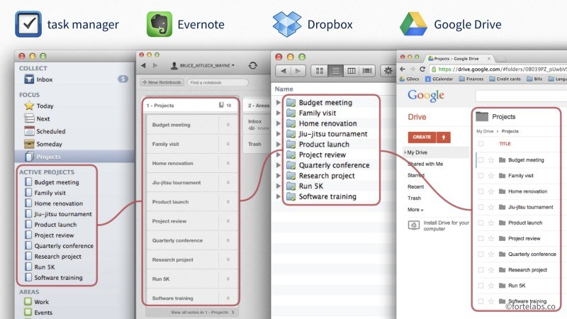

## The P.A.R.A method

*Image from [Forte Labs](https://fortelabs.co/blog/para/).*

**The P.A.R.A. (Projects, Areas, Resources, Archives) method is a method for organizing digital information.**

It was developed by [Forte Labs](https://fortelabs.co/about-forte-labs), a company that creates content to help increase productivity through technology.

### Usefulness of the P.A.R.A. method

The P.A.R.A. method allows you to organize your digital information into different categories, so that it is easy for you to get organized with it. **It allows you to know where to find information in your overall organization, and why**.

These words may sound vague to you, but they make sense when you consider everything you've seen in this workshop so far. You've discovered tools for taking notes, writing tasks, organizing projects; but now, let's imagine that you're faced with the fact that you'd like to try a new recipe that you've been very interested in. Where do you put this recipe? In your notes? Your tasks? Your projects? Where will you keep it, once you have finished it?

The P.A.R.A. method allows you to answer these questions with as little effort as possible. You probably realize that this is very important to you, because having many different tools, adapted to different needs, can be confusing.

### Implementing the P.A.R.A. method

The P.A.R.A method is used like a "map" that will guide you in the use of your different organizational tools.

Globally, we can imagine it as a way to "sort" information according to two characteristics: **their usefulness** (what is it for?), and **their format** (what is its format? On which software?).

#### Sorting information according to its usefulness

To understand how the P.A.R.A. method sorts information according to its usefulness, you only need to understand the 4 elements that make up its name: Project, Area of Responsibility, Resource and Archive.

*Image from [Forte Labs](https://fortelabs.co/blog/para/).*

- A **project** is defined as "*a series of tasks related to a goal, **with a deadline***".

Examples of projects might be "planning this year's vacation"; "writing a blog post"; or "buying a new computer". They all have a specific goal, and a deadline implied in them. In short, the easiest way to know if something is a project is to know if it is supposed to be finished in a given time, after having accomplished different tasks. **Any information about a project will therefore go into project-related files**.

**Understanding what is a project and what is not is very important in the P.A.R.A. method**. One of the reasons for this is that identifying projects allows you to identify what you are completing and what you are finishing, which is very motivating. Conversely, if you confuse project and area of responsibility (see below), you run the risk of not achieving that progress, which is important for your short-term morale; but also for measuring your long-term productivity. What did you achieve last year?

- An **area of responsibility** is defined as "*an area of activity with a standard to be maintained over time*."

Areas of responsibility can be "my health"; "my friends"; "badminton"; "my apartment". These are parts of your life, with fairly well-defined boundaries, that do not represent projects, but which will require you to perform tasks on a daily basis. These tasks are not linked to a specific goal that will end at a certain time. Thus, taking care of your friends is not a project, but a part of your life with certain responsibilities. Similarly, your project to write a blog post might require you to do some work today; but so does going shopping for a niece piece of clothing for your best friend's birthday tomorrow. Distinguishing between project and area of responsibility allows you to use different - but appropriate - tools for both.

One last thing to remember is that **your projects will almost always fall within an area of responsibility**, which is perfectly normal! You can visualize things as in the following diagram, where the little squares represent spots, and the circle represents an area of responsibility.

*Image from [Forte Labs](https://fortelabs.co/blog/para/).*

- A **resource** is defined as "*a topic or theme of interest to you*".

So a resource could be knowledge about space, music, gardening, marketing, psychology, or even...organization. In short, resources would be anything you could put in a *Zettelkasten*! However, you have to distinguish between a resource (like a very interesting article in psychology) and an information (like the address of the store where you will go to shop for your best friend's birthday). This distinction is important, because information does not need to be saved in as readable a way as a resource, which saves time.

- An **archive** is simply "inactive objects from the other three categories*".

Archives would contain information about projects that have been completed (you finished your blog post); areas of responsibility that are no longer part of your life (you quit badminton); or resources that no longer interest you (you no longer watch the *Mew Mew Kissy Cutie* cartoon you used to love).

Now that you understand how the P.A.R.A method sorts information by utility, let's see how it sorts it by format.

#### Sort information by format

Digital information can be in many different formats: a simple text file, an image, a link to a web page, a Microsoft Word file, music, a check mark, and many others. The P.A.R.A. method requires that you make these distinctions clear in a simple and understandable way, so that you don't hesitate for a moment about where to put your information.

The P.A.R.A method does not give a list of particular software to use: it is up to you to make your definition. However, 3 rules should be respected as much as possible:

1. **Limit the number of programs** that you use primarily to manage or back up your digital information **to 4**. The reason behind this number is that it seems to be an important limit in the short-term memory of our brain. Thus, exceeding it makes things much more complex to manage mentally, and often does not give much gain. **Doing more with less** is always a great doctrine!

2. **The structure of the information utilities must be identical in each program**. This means that in each program, you will find categories such as "Projects", "Areas", "Resources" and "Archives"; and that within these categories, the organization of the information utilities must be the same in each program you use. This is important in order to have a unique structure that you will find in all your programs, which reduces your mental load, makes switching from one program to another quicker, and avoids you having to search for a long time to find information. On the following pictures, you will find an example of this with 4 different programs. **Be careful though**: not all programs have to contain all possible types of information! For example, your task manager does not necessarily have to contain folders related to your resources or archives.

*Images from [Forte Labs](https://fortelabs.co/blog/para/).*

3. The software you use should **allow you to hide information that is not useful to you as much as possible** when you are working on something. For example, when you are working on a project, you don't need to have folders and files from your different areas of responsibility, or your resources on your screen. You only need the information related to the project. Therefore, the software you use should, as much as possible, be able to hide all irrelevant information from you so that you don't have to constantly sort through all the information on your screen.

#### Finishing setting up P.A.R.A. at the technical level

Once you have decided on the software you will use to store your digital information, all that remains is to create the structure of your files in each of your software. And that's it, everything is ready!

From now on, all you have to do is put your information in the right place, and in the right software. Do you need to make an appointment with the doctor? This will surely go in a responsibility area named "health", and in a task list or calendar software. Do you want to write down the interesting figure you saw about the number of elephants living in Africa? This will surely go into your resource, into a note program like Joplin; maybe even into your *Zettelkasten*, which integrates very well with the P.A.R.A. method as a resource section! Have you finished your summer camping project? Then move the folder "Camping" from your "Projects" area to your "Archives" area.

In the same way, you will only have to look at the right section in the right software to find the right information. The address of the store where you will go shopping for your best friend is probably in a "Friends.es" area, and is probably in the commentary of a task that you have put in your task manager on this subject. The Word document that contains important data for your work is probably in your file manager, in the corresponding project folder. As for the information you have kept related to the badminton lessons you are taking, they are surely in your archives.

As you can see, filing and retrieving information becomes easier. This is very useful when you start to have a lot of information, or to save time no matter what! Apart from adding and retrieving information, you will only have to maintain your organization from time to time. Hence, when a new area of responsibility is added to your life, all you have to do is add a corresponding folder in each of the programs you use.

### Exercises

During these exercises, we will do as if we had decided to use the P.A.R.A method with the help of Joplin, and different applications in Nextcloud.

Thus, we will put tasks related to projects in Nextcloud Deck (kanban boards); we will put tasks related to areas of responsibility in Nextcloud Tasks; we will put our resources and notes in Joplin; and finally, we will put our files in Nextcloud Files (Nextcloud's file manager, synchronized with your computer).

#### 1. Preparing Nextcloud and Joplin to use the P.A.R.A method

> `r emo::ji("light_bulb")` *In this exercise, I would suggest filling in Nextcloud and Joplin with example headings. However, feel free to fill them with projects or areas of responsibility that fit your life, so you can start using the P.A.R.A method right away!*

- Go to Nextcloud Tasks
  - Create several task lists: "Family", "Friends", "Work", "Karate", "Finances" and "Health".

> `r emo::ji("light_bulb")` *In the P.A.R.A. method, you decide how many different areas of responsibility you will define. You can be more or less specific: make a "Social" area, or a "Family" area, a "Friends" area, etc. The creator of the P.A.R.A. method recommends doing a lot rather than too little, so that you can better sort your information, but also to see more quickly if some aspects of your life are a little ignored.*

> `r emo::ji("light_bulb")` *Don't forget that you can use emojis in the titles of your responsibility areas! This makes them easier to differentiate at first glance. For example: 🚗 Car, 💰 Finance.*

- Go to Nextcloud Deck
  - Create two new tables, in addition to the one created in Nextcloud exercises: "Buying a new computer" and "Bastien's birthday party."

- Go to Joplin
  - Create 4 new notebooks : "1 - Projects", "2 - Areas", "3 - Resources", "4 - Archives

> `r emo::ji("light_bulb")` *The numbers in the titles of your notebooks are to make sure that Joplin keeps them organized in the right order.*

  - In the "1 - Project" notebook, create three new notebooks: "Open Source and organization workshop", "Buying a New Computer" and "Bastien's Birthday Party".
  - In the "2 - Areas" notebook, create 6 new notebooks: "Family", "Friends", "Work", "Karate", "Finances" and "Health".
  - In the notebook "3 - Resources", move the notebook "Zettelkasten" created in the exercises of to the Zettelkasten.

- Go to the "Nextcloud" folder on your computer (which is normally synchronized with your Nextcloud account on Cloudamo, from the exercises on Nextcloud)
  - Create 4 new folders: "1 - Projects", "2 - Areas", "3 - Resources", "4 - Archives"
  - In the "1 - Project" folder, create three new folders: "Open-source and organization workshop", "Buying a new computer" and "Bastien's birthday party".
  - In the folder "2 - Areas", create 6 new folders: "Family", "Friends", "Work", "Karate", "Finances" and "Health".

> `r emo::ji("light_bulb")` *And now you are ready to use the P.A.R.A. method! If you have used projects and areas that fit your life, don't forget to transfer the files and information you already have into the corresponding software.*

#### 2. Working on a project with the P.A.R.A method

- Open Nextcloud Deck, Joplin and the Nextcloud folder on your computer.
- In Nextcloud Deck, choose the painting "Bastien's birthday party". Close the left menu with the small button at the top left of the interface.
- In Joplin, go to the "Bastien's birthday party" notebook. Press F10 to hide the notebook menu (press F10 to make it reappear if needed).
- In your Nextcloud folder, go to the "Bastien's birthday party" folder.
- Now try to invent a birthday party for your fictional (or real) friend Bastien.
  - In Nextcloud Deck, create the "Find the place", "Find the time", "Determine who is invited", and "Determine the activities" cards in the "To Do" column
  - Move the cards into Nextcloud Deck as you complete the tasks. Feel free to make cards in Joplin, insert details in the description of your cards in Nextcloud Deck, or create or save files in your Nextcloud folder to do so.

> `r emo::ji("light_bulb")` *Did you notice during the exercise that limiting the visibility of information that was not relevant to your project helped you focus? Everywhere you looked, you only had resources related to your project; in this way, we limited the work your brain had to do to identify what was important in what it was seeing. This kind of thing is not to be underestimated when you work on a computer for a long time.*

#### 3. Put your resources in the right place with the P.A.R.A method

- Open Nextcloud Deck, Joplin and the Nextcloud folder on your computer, and try to put the following information in the right place:
  - Your friend Julia would like to come to Bastien's birthday party.
  - You should review your *kata* to pass your Karate belt next week.
  - This quote from *Lord of the Rings* about justice and morality: "*Many that live deserve death. And some that die deserve life. Can you give it to them? Then do not be too eager to deal out death in judgement.*
  - This [image of an old world map](https://i.pinimg.com/originals/ba/59/94/ba5994829ba487b5f00b0d7f643a6f58.jpg) you think is very pretty.
  - You've decided that you'd like to buy a laptop instead of a tower, because your current laptop doesn't work very well anymore, and you move around a lot.

> `r emo::ji("light_bulb")` *Some of these resources are easier to place than others: information about Bastien's birthday and the purchase of a new computer could easily go into Nextcloud Deck. The Lord of the Rings quote could go in your Zettelkasten, and your kata review should go in Nextcloud Tasks with a deadline for the task. The old world map image, however, could be inserted into a Joplin note, or dropped directly into your Nextcloud folder.*
