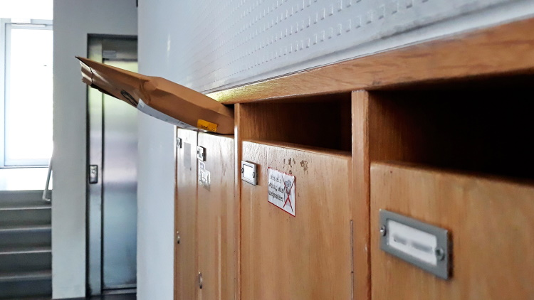

## The inbox method for your tasks

**An inbox is a virtual box in which items (such as emails or tasks) are accumulated and have a certain priority associated with them**. It is simply a virtual box in which items (such as e-mails or tasks) are accumulated and have a certain priority associated with them.

So, in an e-mail *inbox*, the most prioritized and visible mails will be the most recent and unread ones; although mailboxes often allow you to sort messages by other criteria, such as the "important" mark.

### Uses of the *inbox*

Concretely, using an *inbox* for your tasks allows you to quickly visualize which are the most urgent tasks, among those you have to do.

Said like that, it doesn't seem to be something extraordinary, you might say. However, it can be very useful to help you work with a clearer mind, and to focus more on what you have to do.

Imagine the following situation: You are working, during the day, on a weekday. You receive a call from a friend who suggests you go to an *escape game* sometime. You both agree that it will be up to you to choose the *escape game* in question. You then receive an email from your veterinarian, following a health check-up for your cat; your cat is fine, but you'll have to buy him a medication he needs quickly. You suddenly think that you should go shopping today. You should also do some laundry because you haven't done it in a while. Your supervisor at work comes in, and offers you to take care of a task for which you will have to swap with a colleague, who may not be here today. While taking a break, you spill some tea on your pants, and you notice that they have a hole in them; you'll have to get them fixed sometime. You also remember that a long time ago, you told yourself that you should look into updating a particular piece of software on your computer. You wonder if you should do it now, or later. You're now back at your desk; **what do you start with ?**

As you have understood, in our daily life, the number of tasks we have to do can easily become very large, and they can concern many different aspects of our life: our house, our finances, our friends, our pets, our food, our work, our hobbies, our computer tools, and so on. Keeping track of everything that needs to be done in all these different aspects of our lives is extremely complicated in an adult life, which includes many responsibilities. In particular, there is the question of priority: **when we have many tasks to do, which ones should we start with**?

This question of priority for our tasks can be difficult to answer. How do you know if fixing the pants is a higher priority than everything else you have to do? To find out, you would have to compare, one by one, all the tasks you have to do, and compare them together until you determine where your pants repair ranks, and whether you should do it today or tomorrow. This takes a lot of time and energy, especially when you are hesitating between many different tasks!

This is where the *inbox* for tasks comes in. Just like an inbox for your e-mails, this one will allow you to quickly see which tasks should be prioritized, but also to integrate new ones effortlessly. This would leave you much more time to work on your tasks, and will leave you with more peace of mind. No more wondering "*do I remember everything?*", or "*did I lose a paper with my list on it?*".

### Setting up a task *inbox*

To set up a *taskbox*, you simply need a software that allows you to :

- Quickly add a task to your task box
- Associate a priority to a task, with enough nuance to be able to distinguish between them (**just being able to distinguish a task as "important" or not will certainly not be enough**)
- Sort tasks by priority
- See your tasks even when you are not in front of your computer (by synchronizing with your phone)
- [Optionally] Allows you to distinguish tasks from different aspects of your life (it's not mandatory, but it allows you to better find your way around; but also to use the P.A.R.A method!)

Of course, a free open-source software that ticks all these boxes is **Nextcloud Tasks**, which we saw earlier. Indeed, this one allows you to associate a priority from 1 to 10 to your tasks! But others exist, and can be used.

Once you have chosen your software, you will just have to define categories or lists of tasks (as we have seen in the Nextcloud section and the section on the P.A.R.A method) to then start using your *inbox*.

Each time you add a task to it, simply add a priority to it. When you wonder what you should do, simply sort your tasks by priority so you can see the most important ones right away.

> `r emo::ji("light_bulb")` *You can also make a "to do" list in which you can put the tasks you would like to work on today!*

### Exercises

During these exercises, we will use Nextcloud Tasks as *inbox* for your tasks. You can however use another software for this, like [Vikunja](https://vikunja.io/) !

#### 1. Preparing your *inbox*

For this exercise, I refer you to the exercise 1 of the section on the P.A.R.A method, which proposes to set up different lists of tasks according to the different aspects of your life.

#### 2. Add tasks to your *inbox*.

- Go to Nextcloud Tasks.
- In the "Family" task list, add the tasks "Call Mom", "Congratulate Noémie on her graduation", and "Send an email to Thomas".
- Click on each of these tasks in turn. Give them each a priority, respectively: 2, 4, and 6.
- At the top right of the task list, find the button that allows you to sort the tasks by priority.
- In the "Friends" task list, add the tasks "Find out which *escape game* to play with Bastien", "Ask about Maëlie", "Play a video game with Lucie", "Send a letter to Julia" and "Share the open-source and organization workshop with all my friends". Give them priorities 2, 6, 6, 4 and 1 respectively.
- In the "Finances" task list, add the tasks "Make a financial statement for the month" and "Contact my bank about last Sunday's debit", with priorities 3 and 2 respectively.
- In the "Work" task list, add the tasks "Have a meeting with Laurence", "Put water in the plants in the office", "Send the important file to Jack", "Tidy up my desk", "Bring back tea for the breaks", "Send an email to Catherine", and "Prepare the presentation for next Monday". Give them priority 3, 1, 3, 4, 2, 5 and 2 respectively.

#### 3. View the tasks in your *inbox* to select the ones to do

- Go to Nextcloud Tasks.
- Create a new to-do list named "To Do Today."
- In the left menu to choose a to-do list, go to the "All Tasks" smart list
- Look at the contents of your different to-do lists by scrolling down a little at a time. Select the highest priority and most relevant tasks to do today, by dragging and dropping them into the "To Do Today" task list in the left-hand menu.
- Go to your "To Do Today" task list. Use the task sorting button at the top right of the list to sort the tasks manually.
- Move the tasks by clicking on them to arrange them in the order you would like to do them today.
