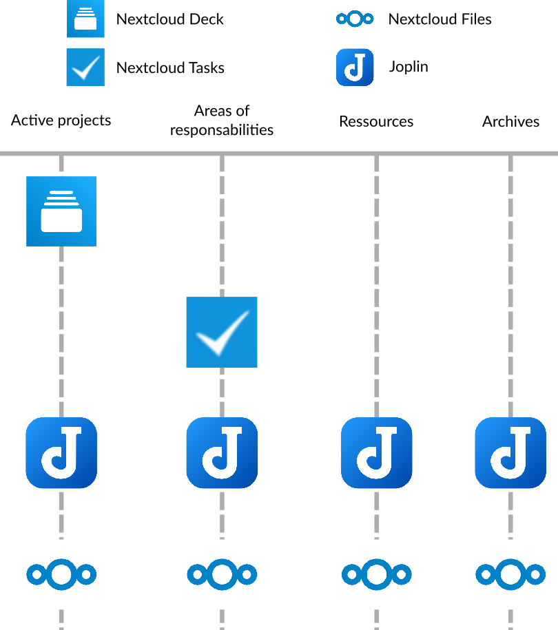
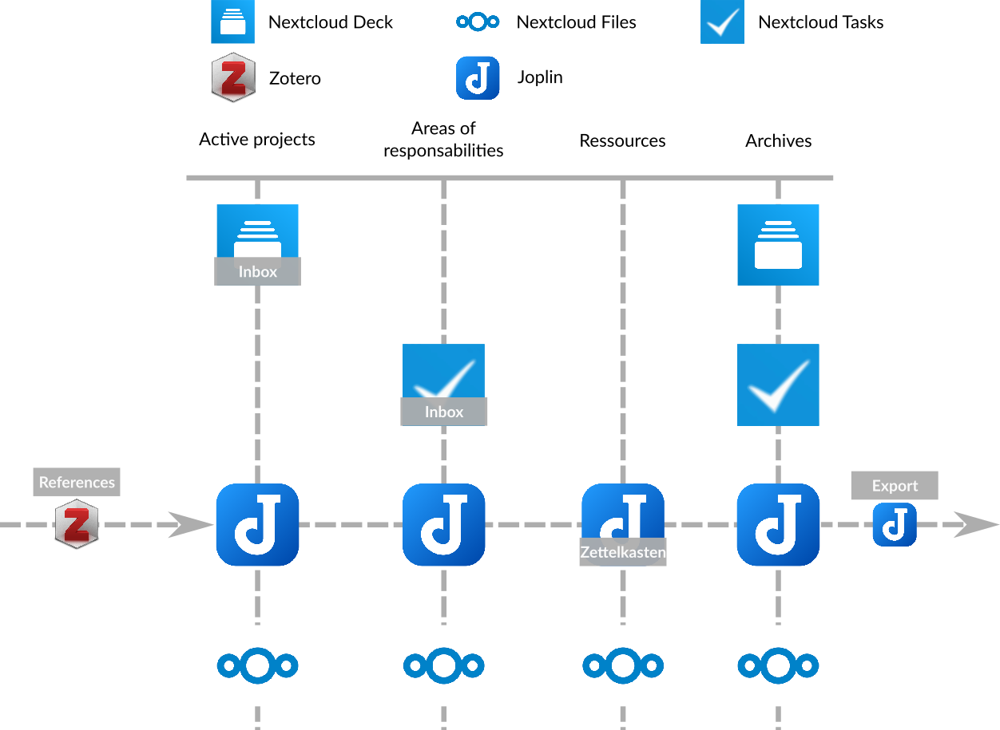

## An example of combining all these tools and methods

We've now seen four different pieces of software that help with organization - Joplin, Zotero, Zettlr and Nextcloud. We've also gone over three different organizational methods - the *Zettelkasten*, the P.A.R.A method and the *inbox*, and you've probably already figured out how these software programs can be used with these different methods. You have also started to experiment the interactions between these 3 methods, which are not mutually exclusive, as they can complement each other.

So I propose you a small summary by presenting you an example of combination of these softwares and these methods together.

### The global structure : the P.A.R.A method

**The P.A.R.A method defines the global structure of this example**. To understand it better, I refer you to the section on the P.A.R.A method.

Thus, 4 softwares are used:

- Nextcloud Deck (which contains data related to projects, in the form of *Kanban* tables)
- Nextcloud Tasks (which contains data related to areas of responsibility, in the form of tasks to check)
- Joplin (which contains notes related to projects, responsibility areas, but also to resources and archives)
- Nextcloud Files (which contains files related to projects, responsibility areas, resources and archives)

The organization of the software could be represented as follows:

### Resource management: The *Zettelkasten*

Within the global structure defined by the P.A.R.A method, it is possible to insert the *Zettelkasten* as a way to structure the resources on the subjects which interest us.

Joplin will take care of this task, and will allow us to store our resources in the form of a *Zettelkasten* in this example. For more details on how a *Zettelkasten* is structured and works, I refer you to the section about it.

### Task management : the *inbox*

Finally, the tasks defined for the different areas of responsibility of the P.A.R.A method (here in Nextcloud Tasks), but also those defined for our different projects (here in Nextcloud Deck) can be managed like an *inbox*.

Thus, all tasks in Nextcloud Tasks and cards in Nextcloud Deck can be associated with priorities, and then be sorted by priority to quickly visualize which tasks must be done. To learn more about managing tasks like an inbox, I refer you to the section on this method.

### Managing references in resources: Zotero and Joplin's BibTex plugin

Within the *Zettlekasten* itself, or in other notes that concern your projects or areas of responsibility, you can insert bibliographic references using Zotero and Joplin.

This way, you will have clean and referenced documents without having to manage a reference database by hand (which can be very complicated). For more information on how to use these two softwares, I refer you to their respective sections.

### Exporting documents in markdown with Joplin

Joplin can also act as a good exporter of markdown documents. Although Joplin is able to export your markdown notes in `.pdf` or `.html` format, other programs (like [Pandoc](https://pandoc.org/) or [Zettlr](https://www.zettlr.com/)) are able to do so in a wider range of formats, and also to add references.

### Summary graph

In the end, here is the structure of this example, through the different software used:

