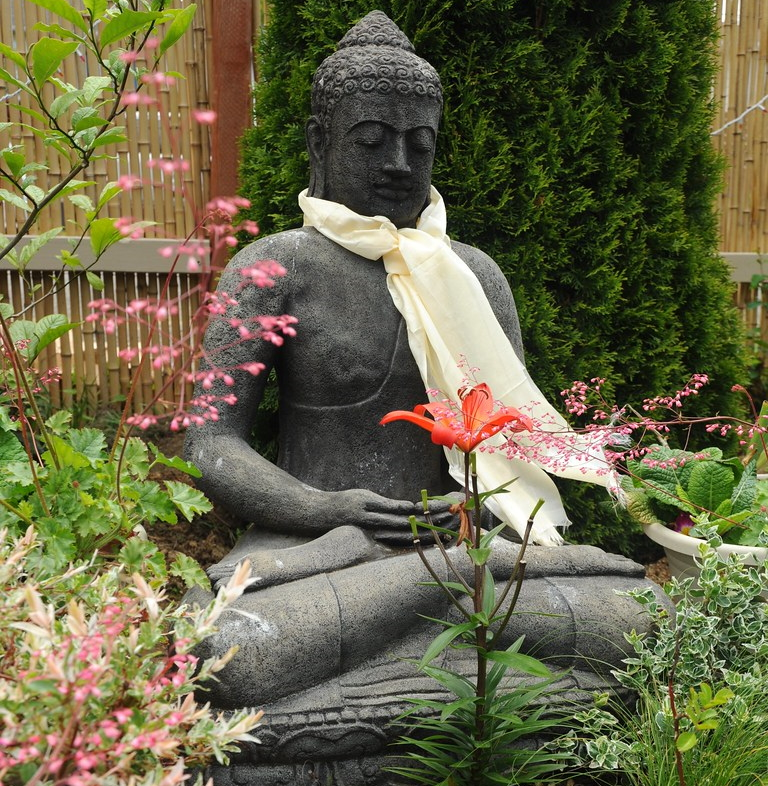
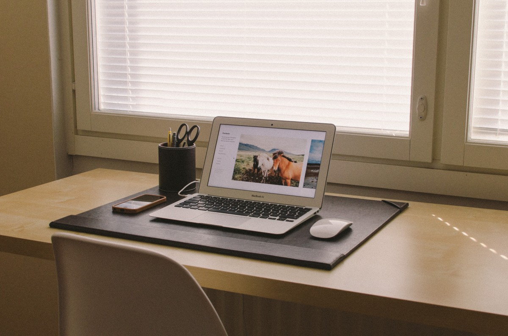

# Final word

Thank you very much for attending this workshop! I hope you have enjoyed it.

I would like to leave you with a few words before we finish this workshop.

First of all, remember that all the software you may have discovered today is totally **free**! However, they all represent many, many hours of work for the people who developed them. So I recommend you to make a small donation to them if you have the financial opportunity, and if you start using these softwares. Just go to their respective websites and follow the instructions.

Also, I'd like to leave you a little link to [my GitHub page](https://github.com/Klemet), if you're curious to discover my other projects, or the tools I develop.

Finally, I'd like to leave you with a few other tips to increase your productivity on top of what we've seen today, as well as some other software to try by yourself.

## Some habits to develop

The [**Pomodoro method**](https://en.wikipedia.org/wiki/Pomodoro_Technique) to take care of your eyes by getting off the screen at regular intervals, but also to get into a rhythm where you are focused on your work. This is a method that has helped me tremendously to become more productive, and I use it daily. There are many programs that allow you to use it, and I personally use [Pomotroid](https://splode.github.io/pomotroid/).

* * *

**Mindfulness meditation** can help you to take care of your emotions, but also to better focus on your work. It is a non-religious meditation which aims to train the mind to become aware of its emotional state, and to be able to refocus on certain stimuli in particular. It is now recommended in some psychological therapies, and [some scientific studies on the subject](https://www.sciencedirect.com/science/article/abs/pii/S0022399903005737) seem to show that it has an effect on well-being and stress reduction.

Many applications exist on the phone to start practicing it, but I personally recommend the [book and recordings of Christophe André on the subject](https://www.christopheandre.com/projects/mediter-jour-apres-jour/). However, it might not be recommended for people who have experienced psychological trauma; don't hesitate to talk to a psychologist before starting.

* * *

Finally, I recommend to **not neglect your workspace**, especially if you spend your day in front of a computer. Choose the right place, a good chair, and consider putting bias lighting behind your screen to make it easier on your eyes. Keep your desk clean, and consider having [a more minimalist style](https://preview.redd.it/rofotad6dty51.jpg?width=960&crop=smart&auto=webp&s=ce63e121f680007bb702b012fcfea11cc287cefb) where everything you don't need at any given time is tucked away and hidden, to limit what you have in your line of sight.

## Some other software to try

In addition to the software we have seen today, I also recommend :

- [Zettlr](https://www.zettlr.com/), an "Academic" Markdown document editor that has complementary functions to those of Joplin.
- [Thunderbird](https://www.thunderbird.net), a mail manager that adapts to any mailbox, and allows to have them all in the same place.
- [Libreoffice](https://www.libreoffice.org/), an office software suite to replace Microsoft Office.

## Thank you!

Good luck with your work. I sincerely hope that these discoveries will help you in your work.

Don't hesitate to share the workshop with your colleagues or friends; it is made for that!

Take care of yourself, and I look forward to having you as a reader again.

**Clément**
